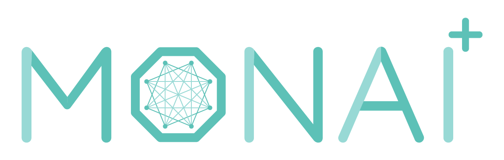
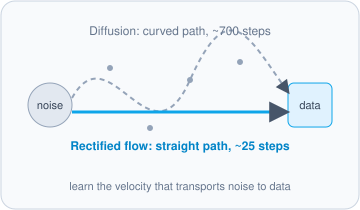
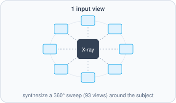
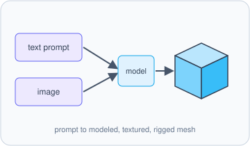
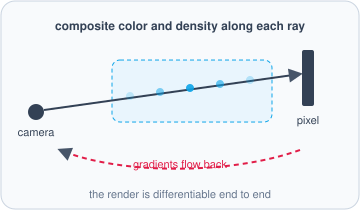
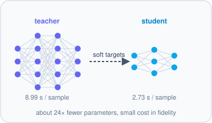
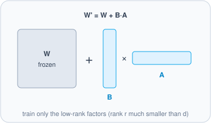

<h1>Hi 👋 I'm Phuc Huynh</h1>
<h3>Research Engineer</h3>

<b>Computer Vision &amp; Graphics</b> · <i>I love cute things 🌸</i>

## 👤 About me

<table>
  <tr>
    <td width="50%" valign="top">
      <b>🌍 Location</b> Ho Chi Minh City, Vietnam  
      <b>🎓 Education</b> B.E. in Computer Science, HCMUT (2021–2025) Major GPA 3.8/4.0
    </td>
    <td width="50%" valign="top">
      <b>💼 Work</b> Research Engineer, GraphicsMiner Vietnam since Jun 2025 · Research Intern Jun 2024 – May 2025  
      <b>🧑‍🏫 Teaching</b> Part-time TA, Computer Graphics and Physical AI, DeepViet since Jul 2026
    </td>
  </tr>
</table>

⚡ My avatar is my favorite character, Kunagisa Tomo.

## 🛠️ Tech

  

  
  
  

  

## 🔬 Research interests

Computer vision and graphics · medical imaging · generative models · world foundation models

<table>
  <tr>
    <td width="50%" align="center" valign="top">
       
      <b>Diffusion &amp; rectified flow</b>
    </td>
    <td width="50%" align="center" valign="top">
       
      <b>Novel view synthesis</b>
    </td>
  </tr>
  <tr>
    <td width="50%" align="center" valign="top">
       
      <b>3D generation</b>
    </td>
    <td width="50%" align="center" valign="top">
       
      <b>Differentiable &amp; volume rendering</b>
    </td>
  </tr>
  <tr>
    <td width="50%" align="center" valign="top">
       
      <b>Knowledge distillation</b>
    </td>
    <td width="50%" align="center" valign="top">
       
      <b>LoRA</b>
    </td>
  </tr>
</table>

## 📊 GitHub stats

  
  

## 🌐 Find me

  
  
  
  

